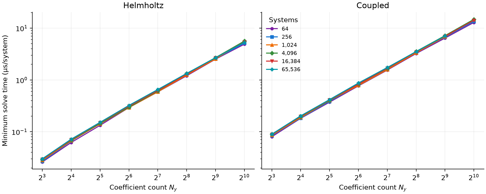
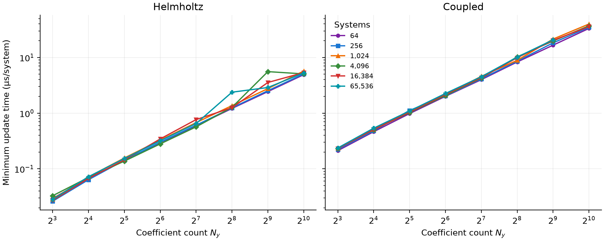
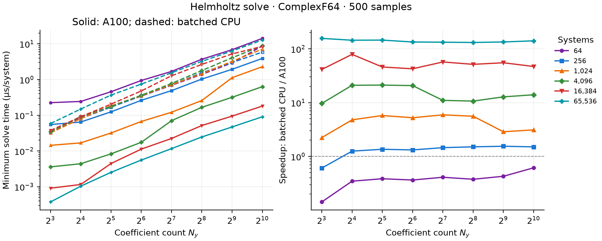
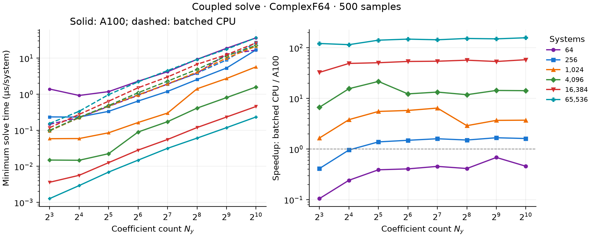
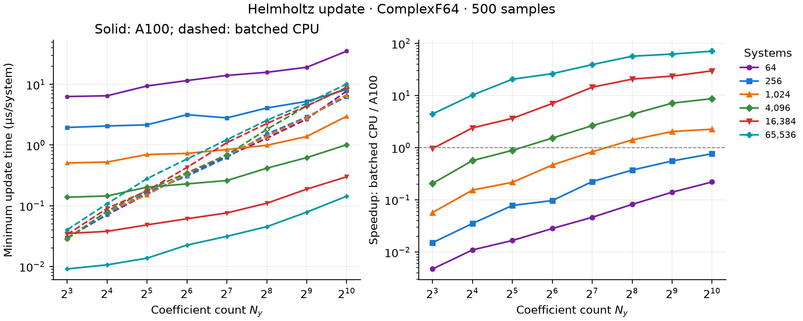
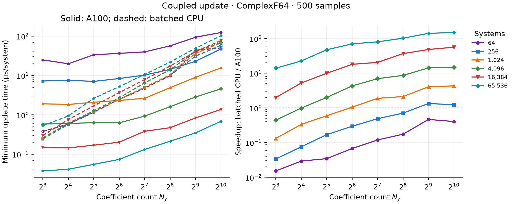
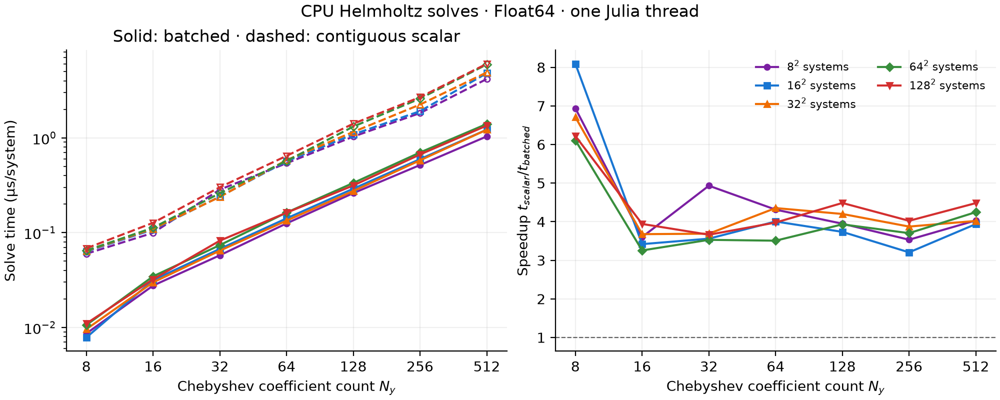
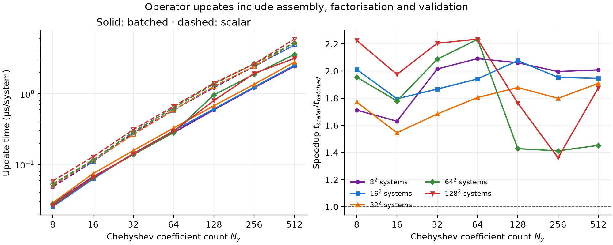

<p align="center">
  
</p>

# ChebyshevHelmoltzSolvers.jl

[](https://github.com/Davide-Lasagna-s-Lab/ChebyshevHelmoltzSolvers.jl/actions/workflows/CI.yml)

ChebyshevHelmoltzSolvers.jl solves one-dimensional Helmholtz and factored
fourth-order boundary-value problems on `[-1, 1]` using the
**Chebyshev tau method**: it expands the solution in Chebyshev polynomials,
imposes the differential equation on the lower-degree residual coefficients,
and uses the remaining equations to enforce boundary conditions
([Canuto et al., 2006](https://doi.org/10.1007/978-3-540-30726-6)).
An integrated coefficient formulation separates even and odd degrees into
quasi-tridiagonal systems, solved by in-place UL factorisation; see
[Greengard (1991)](https://doi.org/10.1137/0728057) and
[Viswanath (2014)](https://arxiv.org/abs/1205.2717v2) for spectral-integration
background. For the coupled fourth-order problem, an **influence-matrix
method** adds homogeneous solutions to a particular solution and determines
their amplitudes from a small system enforcing the remaining boundary
conditions, following the boundary-correction principle used by
[Kleiser and Schumann (1980)](https://publikationen.bibliothek.kit.edu/240013603).
Factors and homogeneous responses are cached for repeated right-hand sides;
independent Helmholtz systems can also be solved in batches on CPU or CUDA.

## Installation

Requires Julia 1.10 or later. Install from GitHub:

```julia
using Pkg
Pkg.add(url="https://github.com/Davide-Lasagna-s-Lab/ChebyshevHelmoltzSolvers.jl")
```

## Chebyshev representation

For the polynomial expansions, transforms and spectral discretisations used
here, see [Canuto et al. (2006)](https://doi.org/10.1007/978-3-540-30726-6),
especially Chapters 2–4.

Functions are represented by truncated expansions in Chebyshev polynomials
of the first kind. A degree-$P$ expansion has $P+1$ coefficients; these are
distinct from the function values at the collocation points.

A one-based `AbstractVector` stores the **ordinary**, unweighted expansion

$$
f_P(y)=\sum_{n=0}^{P}a_n T_n(y),
\qquad T_n(\cos\vartheta)=\cos(n\vartheta).
$$

Index `n+1` stores $a_n$, the coefficient of degree $n$. Use `zeros(T, P+1)`
to allocate an expansion or pass a one-based vector view directly. Both odd
and even polynomial degrees are supported.

The descending Chebyshev–Lobatto points returned by `chebpoints(P)` are

$$
y_j=\cos\left(\frac{j\pi}{P}\right), \qquad j=0,\ldots,P.
$$

Use `chebcoeffs(values)` to convert samples at these points into a coefficient
vector. This uses FFTW's DCT-I, divides the
transform by `P`, and halves the coefficients of degrees `0` and `P`. The input is preserved.

| Operation | Purpose |
| --- | --- |
| `chebpoints(P)` | Return the $P+1$ Chebyshev–Lobatto points from `+1` to `-1`. |
| `chebcoeffs(values)` | Convert descending Lobatto samples into ordinary Chebyshev coefficients. |
| `chebvalues(a)` | Evaluate coefficients at descending Lobatto points. |
| `diff!(a)` | Differentiate Chebyshev coefficients in place on [-1, 1]. |
| `diff!(out, a)` | Differentiate into distinct, non-aliasing output storage. |
| `diff(a, :left)` | Evaluate the derivative at -1 without a derivative workspace. |
| `diff(a, :right)` | Evaluate the derivative at +1. |

## Scalar Helmholtz solver

$$
\theta_0 u''(y)-\theta_1 u(y)=f(y), \qquad -1<y<1,
$$

$$
u(1)=u_+, \qquad u(-1)=u_-.
$$

`HelmoltzSolver(P, T=Float64)` allocates factors and integration weights for degree
`P ≥ 3`, with `P + 1` coefficients. Call `update!` before solving and whenever
the operator coefficients change. Right-hand sides and boundary values can
change without another update.

For example, choose $\theta_0=1$ and $\theta_1=4$, so the equation is
$u''-4u=f$. With $f(y)=-6+4y^2$ and homogeneous boundary values,
the solution is $u(y)=1-y^2$:

```julia
using ChebyshevHelmoltzSolvers

P = 16
h = HelmoltzSolver(P)
update!(h, 1.0, 4.0)

# Sample the right-hand side at Lobatto points, ordered from +1 to -1.
y = chebpoints(P)
f = chebcoeffs(-6 .+ 4 .* y.^2)
u = similar(f)
solve!(h, u, f, 0.0, 0.0)  # preserves f

# u stores the coefficients of (T₀ - T₂)/2.
# u[1] ≈ 0.5, u[3] ≈ -0.5
chebvalues(u)  # ≈ 1 .- y.^2
```

**Boundary arguments are upper then lower:** `solve!(h, u, f, u₊, u₋)`.
Scalar and batched factors are real-valued (`Float32` or `Float64`); both
support real or complex coefficient arrays at the same precision. Input and
output arrays must have matching element types. All `solve!(solver, u, f, ...)`
methods preserve `f` and return `u`; all `update!` methods return the solver.
Use `HelmoltzSolver(P; neum=true)` to prescribe positive-y derivatives at both
walls. Pure Neumann Poisson (`θ₁=0`, `θ₀≠0`) is supported on the CPU with
compatibility validation and a zero-mean solution, as described below.
The scalar tau equations are imposed through degree `P - 2`; the two
highest right-hand-side coefficients do not enter the solve.

### The Chebyshev tau method

A degree-$P$ approximation has $P+1$ unknown coefficients. Imposing every
coefficient equation as well as two boundary conditions would overdetermine
it. The tau method instead retains $P-1$ differential-equation conditions
and uses the two remaining equations for the boundary data. It enforces
conditions on the **spectral residual**, rather than requiring the equation
to hold separately at each Lobatto point.

Writing $u_P$ and $f_P$ for the degree-$P$ expansions, the tau conditions are

$$
\left[\theta_0 u_P''-\theta_1 u_P-f_P\right]_n=0,
\qquad n=0,\ldots,P-2,
$$

Equivalently, the residual may contain only the two highest modes:

$$
\theta_0u_P''-\theta_1u_P-f_P
=\tau_{P-1}T_{P-1}+\tau_PT_P.
$$

The amplitudes $\tau_{P-1}$ and $\tau_P$ are residual coefficients, not
additional inputs. The two boundary conditions are satisfied by the
polynomial solution, while these highest residual components are left
unconstrained. This also explains why the last two forcing coefficients
do not affect the computed solution.
See [Canuto et al. (2006)](https://doi.org/10.1007/978-3-540-30726-6)
for the general tau framework.

Here $[\cdot]_n$ denotes the coefficient of $T_n$. The two boundary equations
complete the $P+1$ equations for the solution coefficients. Integrating the
interior equations twice produces a tridiagonal recurrence within each
parity; the wall conditions supply the dense first row of each block.

For background on integration-based spectral boundary-value solvers, see
[Greengard (1991)](https://doi.org/10.1137/0728057) and
[Viswanath (2014)](https://arxiv.org/abs/1205.2717v2). These discuss related
formulations; the tau truncation and compact UL recurrences implemented here
are specified below.

### Neumann boundary conditions

For `neum=true`, the boundary equations instead prescribe

$$
u'(1)=u_+, \qquad u'(-1)=u_-.
$$

Both derivatives use the positive-$y$ direction. When $\theta_1=0$ and
$\theta_0\ne0$, a Neumann solution would require

$$
\int_{-1}^{1}f(y)\,\mathrm{d}y=\theta_0(u_+-u_-),
$$

and remains undetermined up to an additive constant. CPU scalar and batched
solvers check this compatibility condition and select the unique solution with

$$
\frac{1}{2}\int_{-1}^{1}u(y)\,\mathrm{d}y
=\sum_{\substack{n=0\\n\text{ even}}}^{P}\frac{\widehat u_n}{1-n^2}=0.
$$

The compatibility check uses the **retained forcing** through degree `P-2`,
not the two discarded tau coefficients. Its tolerance is proportional to
machine precision and the magnitudes of the integral and wall contributions.
Incompatible forcing raises `ArgumentError` before modifying the destination;
it is not silently corrected. Internally the redundant even boundary equation
is replaced by a temporary constant-coefficient gauge, then the constant is
shifted to enforce zero mean. The odd boundary equation is retained.

```julia
h = HelmoltzSolver(16; neum=true)
update!(h, 1.0, 0.0)
y = chebpoints(16)
f = chebcoeffs(6 .* y .+ 2)
u = similar(f)
solve!(h, u, f, 5.0, 1.0)
chebvalues(u)  # ≈ y.^3 .+ y.^2 .- 1/3
```

CPU batches may mix singular and shifted Neumann systems. CUDA singular
Neumann support is deferred; its update/solve methods reject that case.

## Coupled Helmholtz solver

$$
\begin{aligned}
\theta_0 u''-\theta_1 u &= f,\\
\theta_2 v''-\theta_3 v &= u,\\
v(\pm1)=v'(\pm1)&=0.
\end{aligned}
$$

Equivalently, with $D=\mathrm{d}/\mathrm{d}y$,

$$
(\theta_0 D^2-\theta_1)(\theta_2 D^2-\theta_3)v=f.
$$

`CoupledHelmoltzSolver` solves this factored fourth-order problem and returns
`v`. Each `update!` factorises both operators, computes the two homogeneous
responses and stores their 2×2 influence matrix. Each `solve!` computes the
particular solution with two scalar Helmholtz solves, then adds the cached
responses to cancel the two wall derivatives.

This is an influence-matrix construction: a small boundary system selects
the amplitudes of homogeneous responses. For historical background in
spectral flow solvers, see [Kleiser and Schumann (1980)](https://publikationen.bibliothek.kit.edu/240013603).
The coupled problem here is the factored fourth-order boundary-value problem
above, rather than a complete incompressible-flow solver.

### The influence-matrix method

Let $\mathcal{L}_1=\theta_0D^2-\theta_1$ and
$\mathcal{L}_2=\theta_2D^2-\theta_3$. Solving each second-order equation
requires two boundary conditions, but the original problem supplies four
conditions on $v$ and none on the intermediate field $u$. The influence
matrix determines the otherwise unknown endpoint values of $u$ so that
all four conditions on $v$ hold.

First compute a particular pair with convenient homogeneous Dirichlet data:

$$
\mathcal{L}_1u_p=f,\quad u_p(-1)=u_p(1)=0,
\qquad
\mathcal{L}_2v_p=u_p,\quad v_p(-1)=v_p(1)=0.
$$

This generally leaves nonzero endpoint derivatives of $v_p$. Construct two
homogeneous response pairs, labelled $+$ and $-$:

$$
\mathcal{L}_1u_\pm=0,\qquad
\mathcal{L}_2v_\pm=u_\pm,\qquad v_\pm(-1)=v_\pm(1)=0,
$$

$$
(u_+(1),u_+(-1))=(1,0),\qquad
(u_-(1),u_-(-1))=(0,1).
$$

All these equations are solved with the same discrete tau operators.
Linearity means that

$$
v=v_p+\delta_+v_++\delta_-v_-
$$

preserves the discrete differential equations and the zero endpoint values.
The remaining derivative conditions reduce to

$$
\underbrace{\begin{pmatrix}
v_+'(1)&v_-'(1)\\
v_+'(-1)&v_-'(-1)
\end{pmatrix}}_{A}
\begin{pmatrix}\delta_+\\\delta_-\end{pmatrix}
=-\begin{pmatrix}v_p'(1)\\v_p'(-1)\end{pmatrix}.
$$

Each column of $A$ measures the effect of one unit endpoint
value of $u$ on the two endpoint derivatives of $v$—hence the name
*influence matrix*. All derivatives refer to the common interval `[-1, 1]`.

The responses and $A$ depend on the operators,
but not on $f$. `update!` computes them once; each subsequent `solve!`
requires only the two particular Helmholtz solves, a $2\times2$ linear solve,
and the response combination. This boundary-correction construction is
related to the influence-matrix technique of
[Kleiser and Schumann (1980)](https://publikationen.bibliothek.kit.edu/240013603);
here it enforces the derivative conditions of the factored fourth-order
problem. The influence matrix must be nonsingular.

### Example

For $v=(1-y^2)^2$, the problem $v^{(4)}=24$ has the required wall conditions:

```julia
P = 16
solver = CoupledHelmoltzSolver(P)
update!(solver, (1.0, 0.0, 1.0, 0.0))

y = chebpoints(P)
f = chebcoeffs(fill(24.0, length(y)))
u = similar(f)
solve!(solver, u, f)  # preserves f

v = chebvalues(u)  # v ≈ (1 .- y.^2).^2

# v = 3T₀/8 - T₂/2 + T₄/8
# u[1] ≈ 0.375, u[3] ≈ -0.5, u[5] ≈ 0.125
```

Use `CoupledHelmoltzSolver(P, ComplexF64)` for complex Fourier coefficients;
the underlying factors remain real. Source and destination must be disjoint
and distinct from the solver's internal workspaces.
The intermediate `u` is not retained. The influence matrix must be nonsingular;
use degree at least four to represent a nonzero solution with four homogeneous
wall conditions.

## Batched CPU Helmholtz solves

The batch solves independent boundary-value problems

$$
\theta_{0,s}u_s''(y)-\theta_{1,s}u_s(y)=f_s(y),
\qquad s=1,\ldots,B.
$$

Each system has its own coefficients and boundary data; systems are not coupled.

`BatchedHelmoltzSolver(P, B, T=Float64; neum=false)` allocates storage for
`B > 0` independent operators of degree `P ≥ 3`, with real factors of type `T`
and real or complex right-hand sides. Call `update!(h, θ₀, θ₁)` before solving
and whenever the operator coefficients change. `θ₀` and `θ₁` are vectors of
length `B` and element type `T`, with one coefficient per system.
The batch supports Dirichlet or Neumann conditions, with derivatives taken
in the positive y direction at **both** walls. Pure Neumann Poisson problems
require a compatibility condition and a choice of the additive constant.

Store coefficients in matrices of size `(B, P+1)`: each row is one
system, and each column is one Chebyshev coefficient:

$$
u_s(y)=\sum_{n=0}^{P}\widehat{u}_{s,n}T_n(y),
\qquad \texttt{u[s,n+1]}=\widehat{u}_{s,n}.
$$

The solver assembles
the integrated equations directly into the output and solves even/odd
coefficients in place. Source and output must be distinct; no transposition,
parity packing or additional RHS array is needed.

```julia
using ChebyshevHelmoltzSolvers

P, B = 32, 100
θ₀ = fill(1.0, B)
θ₁ = collect(range(1.0, 2.0; length=B))
h = BatchedHelmoltzSolver(P, B)
update!(h, θ₀, θ₁)

# Manufactured solution u = 1-y² = (T₀-T₂)/2 in every system.
# θ₀*u'' - θ₁*u = (-2θ₀-θ₁/2)*T₀ + (θ₁/2)*T₂.
rhs = zeros(ComplexF64, B, P+1)
rhs[:, 1] .= -2 .* θ₀ .- θ₁ ./ 2
rhs[:, 3] .= θ₁ ./ 2
u = similar(rhs)
bc = zeros(B)
solve!(h, u, rhs, bc, bc)
# Zero endpoint values; rhs is preserved.
```

Required `u₊, u₋` arguments are one-based vectors of length `B`, one entry
per system. They can be ordinary vectors or externally defined constant-valued
vectors with no backing storage. Both may be complex. Reuse the factors
for changing right-hand sides and wall data. After initialisation, call
`update!(h, θ₀, θ₁)` only when the operator changes. Updates assemble and factor
directly in the existing arrays; they do not construct another solver or copy
a new factor bank. On the CPU, coefficient vectors may be views of larger arrays.

The CPU path uses SIMD across all systems for each coefficient row.

For lower-level work, `BatchedQuasiTridiagonal(B, M, T)` allocates zero
storage for `B` matrices of size `M ≥ 2`. Assemble their entries and call
`ul!(batch)` before solving. The four-array constructor
`BatchedQuasiTridiagonal(b, l, dᵢ, u)` shares the supplied storage, whether
assembled or already factorised; no extra arrays are allocated.
`ldiv!(batch, rhs)` uses the factors to solve **assembled** sources,
which include the boundary equation. Raw Chebyshev forcing should instead go
through `BatchedHelmoltzSolver`. The batch size is encoded in both batched types. `BatchedQuasiTridiagonal`
also encodes the matrix size `M`; both sizes stay fixed for its lifetime.

## Batched coupled Helmholtz solves

`BatchedCoupledHelmoltzSolver` applies the same influence-matrix method to
independent fourth-order problems. Each row stores one system, each column
one Chebyshev coefficient, exactly as for `BatchedHelmoltzSolver`.
The four operator coefficients are vectors, so every system may have a
different pair of Helmholtz operators:

$$
(\theta_{0,s}D^2-\theta_{1,s})(\theta_{2,s}D^2-\theta_{3,s})u_s=f_s,
\qquad u_s(\pm1)=u_s'(\pm1)=0.
$$

```julia
B, P = 256, 32
h = BatchedCoupledHelmoltzSolver(P, B, ComplexF64)
θs = (ones(B), zeros(B), ones(B), zeros(B))
update!(h, θs)                         # D⁴u = f in this example
f = zeros(ComplexF64, B, P+1)
f[:, 1] .= 24                         # f(y)=24
u = similar(f)
solve!(h, u, f)                        # u(y)=(1-y²)²; f is preserved
```

`update!` factors both operator banks and caches the two homogeneous
responses and inverse 2×2 influence matrix for every system. Each `solve!`
then needs only two particular Helmholtz solves and a wall-slope correction.
It reuses the allocated workspaces. CPU correction loops run across
contiguous systems for SIMD; the CUDA correction assigns one system to each
thread. Do not use the same solver concurrently from multiple tasks or streams.

## GPU Helmholtz solves

The following example creates and transfers a complete Helmholtz batch.

CUDA support is an optional package extension. Install
[CUDA.jl](https://cuda.juliagpu.org/stable/installation/overview/) in your Julia
environment together with `Adapt` (`Pkg.add(["CUDA", "Adapt"])`), and load
them before using device arrays:

```julia
using CUDA, Adapt, ChebyshevHelmoltzSolvers

B, P = 256, 32
h = BatchedHelmoltzSolver(P, B)
update!(h, ones(B), ones(B))       # u″ - u = f
rhs = zeros(ComplexF64, B, P+1)
rhs[:, 1] .= 1                   # f(y)=1
bc = zeros(B)                    # homogeneous Dirichlet walls

CUDA.functional() || error("A working NVIDIA CUDA device is required")
CUDA.allowscalar(false)
h_gpu = adapt(CuArray, h)  # transfer factors once; preserve Float64 precision
rhs_gpu = CuArray(rhs)
u_gpu = similar(rhs_gpu)

bc_gpu = CuArray(bc)
solve!(h_gpu, u_gpu, rhs_gpu, bc_gpu, bc_gpu)
CUDA.synchronize()  # needed for timings or explicit host-side completion
```

The CUDA kernel assigns one thread to each system. Adjacent threads operate
on adjacent systems, using real factors for real or complex right-hand sides.
A Dirichlet solve performs one kernel launch, with no host transfers or
temporary RHS arrays. Neumann solves additionally check that no unsupported
singular system is present. Keep stored fields, factors and boundary vectors on the GPU;
a custom storage-free boundary vector must be compatible with CUDA kernels.

A GPU `update!` also assembles and factors on the device. Device coefficient
vectors are used directly; CPU coefficient vectors are transferred first.
Only these two vectors need uploading, not the much larger factor arrays.
Updates reject zero or nonfinite UL pivots and nonfinite reciprocal pivots;
construction only allocates storage.

The CUDA path chooses its own thread-block size.

GPU support covers `BatchedHelmoltzSolver`, `BatchedCoupledHelmoltzSolver`
and `BatchedQuasiTridiagonal`. Scalar solvers and FFTW profile transforms
retain their CPU interfaces. For a coupled solve, transfer the solver and
fields in the same way, then call `solve!(h_gpu, u_gpu, rhs_gpu)`.
To rebuild coupled operators on device, use
`update!(h_gpu, map(CuArray, θs))`. Boundary conditions remain clamped and
homogeneous. Singular Neumann Poisson batches remain CPU-only.

### CUDA verification and timing

Run from the repository root on the A100 (or another supported NVIDIA GPU):

```sh
julia --project=test/cuda -e 'using Pkg; Pkg.develop(path="."); Pkg.instantiate()'
julia --project=test/cuda test/cuda/runtests.jl
julia --threads=1 --project=test/cuda perf/benchmark_devices.jl cuda gpu-results.csv
```

The CUDA tests require a functional device and fail explicitly if none is
available. They disable host scalar indexing and check manufactured solutions,
complex wall data, both boundary conditions, parity views and factor updates.
The benchmark warms up first and synchronizes GPU execution; it measures
complete batched solves with native y-last storage. Factorisation and data
transfers are setup costs and are excluded from solve timings.

The ordinary CPU test suite does not load CUDA. The repository includes a
GitHub Actions workflow for Julia 1.10 and the current stable Julia; that
CPU workflow is not a GPU verification.
The CUDA implementation has been validated on an NVIDIA A100 80 GB PCIe,
with scalar indexing disabled: 7,458 CUDA checks cover the Helmholtz, UL,
backend-contract and coupled paths. The GPU test target also runs CPU
reference checks. Recorded logs accompany the benchmark results.

## Batched CPU and A100 benchmarks

The current benchmark measures **Helmholtz and coupled Helmholtz** solvers at
`N_y = 8,16,32,64,128,256,512,1024` coefficients and
`B = 64,256,1024,4096,16384,65536` systems. Fields use `ComplexF64` in native
`(system, coefficient)` storage. Every point is the **minimum of 500 warmed
samples**, with short calls repeated within each sample to reduce timer noise.
This is a minimum-time estimate, not a typical latency or confidence interval.

The measured solver revision is
[`92072b1`](https://github.com/Davide-Lasagna-s-Lab/ChebyshevHelmoltzSolvers.jl/commit/92072b170312604ed4f60cfcfcca4d5a08084af5).
The [raw results and environment records](perf/results/92072b1/README.md)
identify the hardware, software versions and benchmark script hash.

### Local CPU

These measurements use an Apple M5 MacBook Air, Julia 1.12.6, and one Julia
and BLAS thread. Batching exposes SIMD across contiguous systems; the solver
kernels do not use BLAS. The plots show **time per system**, so every batch
time is divided by $B$. Coupled updates include both factorizations and
rebuilding the homogeneous responses and influence matrices.

The Mac completed 95 of 96 configurations. The coupled case with
$N_y=1024$ and $B=65536$ was stopped after memory pressure caused substantial
swapping on the 16 GB machine. That point is omitted, not extrapolated; the
compute-node sweep includes it.





### NVIDIA A100

The A100 80 GB PCIe measurements include a **batched CPU baseline on the same
compute node**, using one Julia and BLAS thread. The plotted speedup is

$$
S = \frac{t_{\mathrm{batched\ CPU}}}{t_{\mathrm{A100}}}.
$$

Values above one favour the GPU. The local Mac timings are separate results
and are not used in this ratio. CPU batching already uses SIMD; this is not
a comparison against a scalar loop of independent solvers.

GPU timings include public API checks, kernel launches and synchronization.
Solver/field construction, compilation and host/device transfers are excluded:
factors and fields remain on the device. Any work performed inside the public
solve or update call is included. GPU results are checked against the CPU result
before timing each configuration. Update timings are measured separately
from repeated solves.

At the largest Helmholtz case ($N_y=1024$, $B=65536$), the measured solve
minimum is **5.95 ms on the A100 versus 837 ms on the batched CPU**,
approximately **141× faster**. Updating the same operator bank takes
**9.39 ms versus 664 ms**, approximately **71× faster**. These ratios use
the single-threaded Xeon baseline, not a fully threaded CPU implementation.

At the same largest size, the **coupled** solve takes **15.31 ms versus
2.41 s**, approximately **157× faster**. Its update, including cached
homogeneous responses, takes **45.10 ms versus 6.75 s**, approximately
**150× faster**.





Small batches may be slower on the GPU because launch overhead and too few
independent systems limit useful parallelism. At larger batch sizes, threads
work on many independent systems with contiguous accesses. Increasing $N_y$
alone lengthens each thread's sequential recurrence; it does not create more
independent GPU work. These are solver measurements, not full DNS speedups.

Operator setup has a different cost from repeated solves. In particular,
coupled `update!` also recomputes the cached influence responses; its speedup
must not be inferred from the solve plot.





See [reproduction instructions](perf/README.md) for sample-count and size
controls. No layout conversion is part of these measurements.

<details>
<summary>Historical scalar-versus-batched CPU comparison (Float64)</summary>


Measured on an **Apple M5 MacBook Air**, Julia **1.12.6** (`apple-m1` LLVM
target), Float64, one Julia thread and one BLAS thread, on 2026-09-23.
These are **complete Helmholtz solves**, including RHS assembly, boundary
conditions, both parity substitutions and public API checks. Factors are
reused. Each point is the minimum of 100 warmed samples. The solve-time plot
shows time per system (batch time divided by $B$); update times are per batch.

Across `N_y = 8, 16, 32, 64, 128, 256, 512` and batch sizes
`B = 64, 256, 1024, 4096, 16384`, native batched solves were
**3.21–8.09× faster** than independent scalar solves with contiguous
coefficient vectors. Colours and markers identify batch sizes.

The plotted solve speedup is

$$
S_{\mathrm{solve}}=\frac{t_{\mathrm{scalar\ loop}}}{t_{\mathrm{batched}}},
$$

so values greater than one favour batching. The update figure uses the same
convention: $S_{\mathrm{update}}=t_{\mathrm{scalar\ update}}/t_{\mathrm{batched\ update}}$.

The batched algorithm exposes **SIMD vectorisation across systems**. Within
one system, each elimination or substitution step depends on neighbouring
coefficients, so those steps remain sequential. At a fixed coefficient,
however, the same operation can be applied independently to every system.
The batched loops put that system index innermost and use `@simd`, allowing
the compiler to process several systems with each vector instruction.
The `(system, coefficient)` layout makes these accesses contiguous.

This is single-threaded vectorisation, not multithreading or a BLAS speedup.
The arithmetic complexity remains $\mathcal{O}(BP)$. The measured solve gains combine
SIMD, memory-access behaviour and amortised per-call overhead; the benchmarks
do not isolate the contribution of SIMD alone. Both solve paths are
allocation-free, so their timing difference is not due to garbage collection.



Both solve paths measured **zero allocations** after warm-up in this sweep.
Factors and RHS/output arrays are allocated before timing.

Batched `update!` also measured **zero allocations** after warm-up and was
**1.36–2.24× faster** than updating the independent scalar solvers.
Assembly and UL factorisation sweep contiguous systems with SIMD, while
retaining coefficient, alias and pivot validation. Factors and integration
weights are reused in place.

The same loop ordering exposes independent operations to SIMD during
assembly and factorisation. Compared with the previous system-by-system
batched update, this also removes strided row traversal and temporary
wrappers. Its improvement therefore combines vectorisation, contiguous
access and allocation removal. Speedup varies with problem size because
memory traffic, cache capacity and validation costs also affect runtime.



See [benchmark scripts and reproduction instructions](perf/README.md),
[raw solve/update measurements](perf/results/helmoltz-cpu.csv), and
[environment details](perf/results/environment.txt). These are local CPU
measurements from the earlier Float64 implementation, not complete DNS
timings. The newer ComplexF64 CPU/A100 measurements are recorded separately.

</details>

## Quasi-tridiagonal matrices and UL factorisation

### Where the structure comes from

The quasi-tridiagonal matrices are the **even and odd coefficient blocks of
each Helmholtz solve**. They are not differentiation matrices on the
collocation grid. Their unknowns are Chebyshev coefficients.

Directly differentiating a Chebyshev expansion twice couples a coefficient
to many higher coefficients of the same parity. The solver instead
integrates the differential equation twice. Integration has a short
recurrence: for $n\ge2$,

$$
\int T_n(\xi)\,\mathrm{d}\xi
=\frac{T_{n+1}(\xi)}{2(n+1)}
-\frac{T_{n-1}(\xi)}{2(n-1)}+C.
$$

Thus two integrations couple only degrees $n-2$, $n$ and $n+2$, with
special weights at the lowest degrees. The twice-integrated second
derivative recovers $u$ up to an affine function; its two integration
constants affect only degrees zero and one. Boundary conditions determine
those two remaining degrees of freedom.

For $\alpha=\theta_0[2/(b-a)]^2$, the retained integrated equations have
the form

$$
-\theta_1 L_n\widehat{u}_{n-2}
+(\alpha+\theta_1 D_n)\widehat{u}_n
-\theta_1 H_n\widehat{u}_{n+2}
=
L_n\widehat{f}_{n-2}-D_n\widehat{f}_n+H_n\widehat{f}_{n+2},
\qquad n=2,\ldots,P.
$$

Here $L_n,D_n,H_n$ are the cached integration weights. Their terminal
values incorporate the tau truncation, and terms beyond the expansion are
absent. Because the degree changes by two, the unknowns split into

$$
\mathbf{u}_{\mathrm{even}}=(\widehat{u}_0,\widehat{u}_2,\widehat{u}_4,\ldots),
\qquad
\mathbf{u}_{\mathrm{odd}}=(\widehat{u}_1,\widehat{u}_3,\widehat{u}_5,\ldots).
$$

Within either ordering, each interior equation involves only the previous,
current and next unknown: it is **tridiagonal**.

The wall equations supply the extra row. Since $T_n(1)=1$ and
$T_n(-1)=(-1)^n$, Dirichlet data give

$$
\sum_{n\ \mathrm{even}}\widehat{u}_n=\frac{u_++u_-}{2},
\qquad
\sum_{n\ \mathrm{odd}}\widehat{u}_n=\frac{u_+-u_-}{2}.
$$

Each equation touches every coefficient in its parity block, so it forms a
**dense first row**. Neumann conditions have the same structure, with
weights $[2/(b-a)]n^2$ and the corresponding even/odd combinations of wall
derivatives. A tridiagonal interior plus this dense boundary row is what
we call *quasi-tridiagonal*.

`HelmoltzSolver` stores these blocks as `Be` and `Bo`, of sizes
$\lfloor P/2\rfloor+1$ and $\lfloor(P+1)/2\rfloor$, respectively.
`CoupledHelmoltzSolver` uses two such Helmholtz solvers, and therefore four
parity blocks, followed by its small influence-matrix correction.
`BatchedHelmoltzSolver` stores a bank of `Be` and `Bo` blocks, one pair per
independent problem. The batch adds independent systems; it does not change
the matrix structure.

### Compact storage

`QuasiTridiagonal(M, T)` stores a matrix with a dense first row and a
tridiagonal interior. For example, when $M=5$,

$$
Q=
\begin{pmatrix}
b_1 & b_2 & b_3 & b_4 & b_5 \\
l_1 & d_2 & u_2 & 0 & 0 \\
0 & l_2 & d_3 & u_3 & 0 \\
0 & 0 & l_3 & d_4 & u_4 \\
0 & 0 & 0 & l_4 & d_5
\end{pmatrix}.
$$

This is the structure of each even/odd Helmholtz block: the dense row
imposes a boundary condition, and the other rows are the integrated
coefficient equations. Only four vectors are stored, rather than a dense
$M\times M$ array:

| Field | Before `ul!(Q)` | After `ul!(Q)` |
| --- | --- | --- |
| `b`, length $M$ | Dense first row $b_i$ | Reciprocal $1/\beta_1$ at index 1; entries $\beta_i$ for $i\ge2$ |
| `l`, length $M-1$ | Subdiagonal $l_i$ | Multipliers $\ell_i$ of the unit lower factor |
| `dᵢ`, length $M-1$ | Interior diagonal $d_{i+1}$ | Reciprocal pivots $1/p_{i+1}$ |
| `u`, length $M-2$ | Superdiagonal $u_{i+1}$ | Unchanged |

The size constructor allocates zero-filled assembly buffers. Alternatively,
`QuasiTridiagonal(b, l, dᵢ, u)` wraps existing vectors without copying.
The name `dᵢ` describes its contents **after factorisation**; ordinary diagonal
entries must be supplied when assembling a new matrix.

### Why UL rather than LU?

`ul!(Q)` factors the assembled matrix as $Q=UL$, where

$$
U=
\begin{pmatrix}
\beta_1 & \beta_2 & \beta_3 & \beta_4 & \beta_5 \\
0 & p_2 & u_2 & 0 & 0 \\
0 & 0 & p_3 & u_3 & 0 \\
0 & 0 & 0 & p_4 & u_4 \\
0 & 0 & 0 & 0 & p_5
\end{pmatrix},
\qquad
L=
\begin{pmatrix}
1 & 0 & 0 & 0 & 0 \\
\ell_1 & 1 & 0 & 0 & 0 \\
0 & \ell_2 & 1 & 0 & 0 \\
0 & 0 & \ell_3 & 1 & 0 \\
0 & 0 & 0 & \ell_4 & 1
\end{pmatrix}.
$$

Eliminating from the bottom upwards preserves this compact structure:
$U$ is upper bidiagonal below its dense first row, and $L$ is unit lower
bidiagonal. A conventional top-down elimination would spread the dense
boundary row into the interior.

Start with $p_M=d_M$. For $i=M-1,\ldots,2$, compute

$$
\ell_i=\frac{l_i}{p_{i+1}},\qquad
p_i=d_i-u_i\ell_i,
$$

then set $\ell_1=l_1/p_2$. The dense row satisfies

$$
\beta_M=b_M,\qquad
\beta_i=b_i-\beta_{i+1}\ell_i,
\qquad i=M-1,\ldots,1.
$$

The implementation interleaves these two backward recurrences and overwrites
the assembly buffers. After elimination, it stores reciprocal pivots
$1/p_i$ and $1/\beta_1$, so repeated solves multiply instead of dividing.
There is no pivoting; all pivots and their reciprocals must be finite and
nonzero.

### Solving with the factors

`ldiv!(Q, rhs)` solves $Qx=r$ by first solving $Uz=r$ backwards:

$$
z_M=\frac{r_M}{p_M},\qquad
z_i=\frac{r_i-u_i z_{i+1}}{p_i},\qquad i=M-1,\ldots,2,
$$

$$
z_1=\frac{r_1-\sum_{j=2}^{M}\beta_j z_j}{\beta_1}.
$$

It then solves $Lx=z$ forwards:

$$
x_1=z_1,\qquad x_i=z_i-\ell_{i-1}x_{i-1},\qquad i=2,\ldots,M.
$$

Both passes overwrite `rhs`; the first entry accumulates the dense-row
residual as the other entries become available. No temporary solution vector
is needed, and the factors are preserved for the next right-hand side.
Factorisation and substitution each require $\mathcal{O}(M)$ work and storage.

After `ul!`, indexing and `Matrix(Q)` expose the **compact factor storage**:
$U$ on and above the diagonal and the multipliers of $L$ below it, with
reciprocals converted back to pivots. They do not reconstruct the original
matrix $UL$. Before factorisation, access the assembly buffers directly.
Reassemble the original entries before calling `ul!` again; `update!` does
this automatically for Helmholtz solvers.

`BatchedQuasiTridiagonal` uses exactly the same recurrences and storage
convention, with a leading system index. CPU loops apply each recurrence
step across contiguous systems using SIMD; CUDA assigns a system to each
thread. Systems are independent, and no dense matrix is constructed.

## Cost and numerical requirements

Storage, factorisation and scalar solves scale as $\mathcal{O}(P)$. Substitutions
multiply by the stored reciprocals instead of dividing, without allocating
additional reciprocal arrays. The coupled solver also scales as $\mathcal{O}(P)$,
with its homogeneous problems paid for at
`update!` time. The coupled solver reuses a mutable workspace; use a separate instance for
each concurrent task. Scalar and batched factors can be shared by solves
with disjoint destination arrays, provided no concurrent `update!` occurs.

UL factorisation has no pivoting. Scalar and batched `update!` reject zero or
nonfinite reciprocal pivots. Scalar `solve!` also checks the factors before
modifying the output. Construction only allocates storage: call `update!`
before solving. A nonsingular negative-shift matrix can still cause an
unpivoted breakdown (for example `P=4`, `θ₀=1`, `θ₁=-6`); an error is raised,
not a pivoted fallback. After a failed factorisation, perform a successful
`update!` before reusing the solver. Coefficients must be finite with `θ₀≠0`.
The coupled influence matrix must also be invertible.
Multiplication by a stored reciprocal can round differently from direct
division; a finite nonzero pivot can also have an overflowing reciprocal.
Floating-point conditioning and range still limit accuracy as the degree or
operator parameters increase.

## Tests

From a checkout:

```sh
julia --project -e 'using Pkg; Pkg.test()'
```

The deterministic suite checks one-based coefficient vectors and views, in-place
differentiation, wall derivatives, UL reconstruction and repeated solves,
reciprocal-pivot refresh and preservation, analytic scalar and coupled solutions,
real and complex coefficients,
single and double precision, odd/even degrees, operator updates and
preservation of cached homogeneous responses. Additional tests cover an
independent dense tau operator, convergence through degree 512, near-singular
shifted Neumann systems, compatible Poisson gauges, and failure before output
mutation. See [the test guide](test/README.md). Tests need only Julia's
`Test` standard library in addition to the package dependencies.

## References

- C. Canuto, M. Y. Hussaini, A. Quarteroni and T. A. Zang (2006).
  *Spectral Methods: Fundamentals in Single Domains*. Springer.
  [DOI: 10.1007/978-3-540-30726-6](https://doi.org/10.1007/978-3-540-30726-6).
  Background for Chebyshev approximation, spectral discretisation and algebraic solvers.
- L. Greengard (1991). “Spectral Integration and Two-Point Boundary Value
  Problems.” *SIAM Journal on Numerical Analysis*, **28**(4), 1071–1080.
  [DOI: 10.1137/0728057](https://doi.org/10.1137/0728057);
  [author-hosted paper](https://math.nyu.edu/~greengar/specint_sinum.pdf).
  An integration-based formulation for constant-coefficient boundary-value problems.
- D. Viswanath (2014 revision). “Spectral integration of linear boundary
  value problems.” [arXiv:1205.2717v2](https://arxiv.org/abs/1205.2717v2)
  (first submitted in 2012). Discusses spectral integration, bordered banded
  systems and numerical accuracy.
- L. Kleiser and U. Schumann (1980). “Treatment of incompressibility and
  boundary conditions in 3-D numerical spectral simulations of plane channel
  flows.” In *Proceedings of the Third GAMM Conference on Numerical Methods
  in Fluid Mechanics*, Notes on Numerical Fluid Mechanics, vol. 2, Vieweg.
  [Institutional record](https://publikationen.bibliothek.kit.edu/240013603).
  Historical reference for influence-matrix treatment of spectral boundary conditions.

The logo adapts the illustration and visual identity of FDHelmoltzSolver.jl.

## Licence

MIT licence. Copyright © 2026 Davide Lasagna. See [LICENSE](LICENSE).
